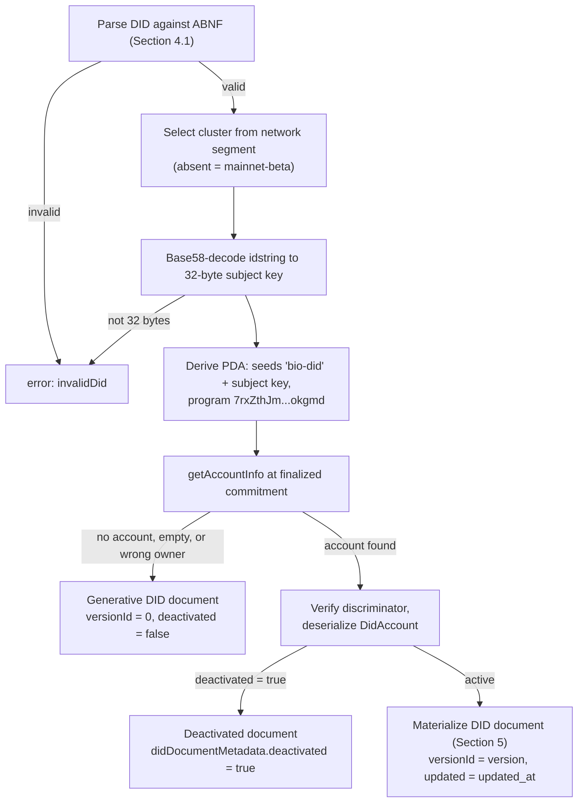
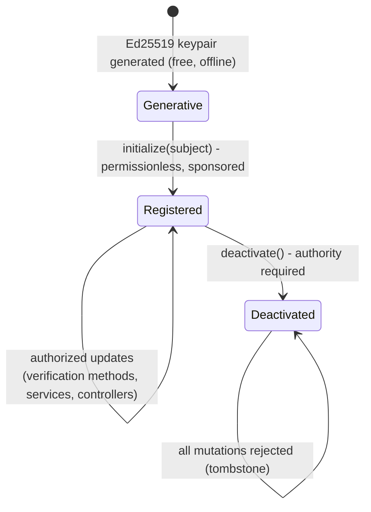
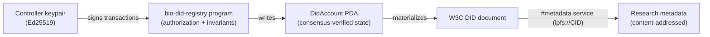

# The `did:bio` DID Method Specification v1.0

**A W3C DID 1.0 conformant DID method for biological research data, anchored on the Solana blockchain.**

- Latest editor's draft: this document
- Conforms to: [Decentralized Identifiers (DIDs) v1.0](https://www.w3.org/TR/did-1.0/), W3C Recommendation 19 July 2022
- Verifiable data registry: the `bio-did-registry` Solana program
- Program ID: `H1gnV4GjNT3UV7AgGNUCkSaciuVVtM7hKb8JhPV3Xxy6` (live on Solana devnet)
- Reference implementation: <https://github.com/ekayana-labs/bio-did-registry>

---

## 1. Abstract

`did:bio` is a DID method for identifying research datasets, researchers, and
research infrastructure in the Ekayaan / Bio-DID-Seq platform. Identifiers are
derived from Ed25519 public keys; DID documents are materialized from accounts
owned by the `bio-did-registry` program on the Solana blockchain, which acts as
the verifiable data registry. Every syntactically valid `did:bio` identifier
resolves - identifiers without on-chain state resolve to a deterministic
*generative* DID document containing the subject key itself, at zero cost.
Writing an on-chain registry entry unlocks key rotation, additional
verification methods (including an experimental post-quantum ML-DSA-87 type),
service endpoints (typically IPFS content identifiers carrying research
metadata), and cross method controllers.

The key words MUST, MUST NOT, SHOULD, SHOULD NOT, RECOMMENDED, and MAY in
this document are to be interpreted as described in
[BCP 14](https://www.rfc-editor.org/info/bcp14)
([RFC 2119](https://www.rfc-editor.org/rfc/rfc2119),
[RFC 8174](https://www.rfc-editor.org/rfc/rfc8174)) when, and only when,
they appear in all capitals, as shown here.

## 2. Conformance

This specification is written against DID 1.0 Section 8 ("Methods"): Section 8.1 Method
Syntax, Section 8.2 Method Operations, Section 8.3 Security Requirements, and Section 8.4 Privacy
Requirements. DID documents produced by this method conform to DID 1.0 Section 4
(Data Model) and Section 5 (Core Properties). Verification material uses the
`Multikey` type defined by
[Controlled Identifiers v1.0](https://www.w3.org/TR/cid-1.0/) (W3C
Recommendation, 15 May 2025).

*Forward compatibility:* DID 1.1 (Candidate Recommendation, 2026) renumbers
the method-spec requirements to Section 7 and layers the data model on
Controlled Identifiers v1.0; the method-definition requirements themselves
are unchanged. One representation-level difference applies: DID 1.1 replaces
the `application/did+json` / `application/did+ld+json` media types with the
single registered type `application/did`, so resolvers targeting DID 1.1
serve the same JSON-LD serialization as `application/did`.

## 3. Method Name

The namestring that identifies this DID method is: **`bio`**.

A DID that uses this method MUST begin with the prefix `did:bio:`. The prefix
MUST be in lowercase. This satisfies the `method-name` ABNF of DID 1.0 Section 3.1
(`1*method-char`, where `method-char = %x61-7A / DIGIT`).

This method defines exactly one method-specific DID scheme, identified by
exactly one method name. To reduce the chance of method-name conflicts this
specification is to be registered in the DID Extensions registry (see
[Section 10 Registration](#10-registration)); as of 2026-07-20 no method named
`bio` exists among the registered methods.

## 4. Method-Specific Identifier

### 4.1 Syntax

```abnf
bio-did      = %s"did:bio" *1(":" network) ":" idstring
network      = %s"devnet" / %s"testnet" / %s"localnet"
idstring     = 32*44base58char
base58char   = %x31-39            ; 1-9
             / %x41-48 / %x4A-4E  ; A-H J-N   (no I)
             / %x50-5A            ; P-Z       (no O)
             / %x61-6B / %x6D-7A  ; a-k m-z   (no l)
```

Terminals use numeric ranges and RFC 7405 case-sensitive literals
(`%s"..."`), because plain RFC 5234 quoted strings are case-insensitive. The
character set is the Bitcoin/IPFS base58 alphabet (omitting `0`, `O`, `I`,
`l`). Matching regular expression for the full DID:

```
^did:bio(:(devnet|testnet|localnet))?:[1-9A-HJ-NP-Za-km-z]{32,44}$
```

This syntax complies with the `method-specific-id` ABNF rule of DID 1.0 Section 3.1,
including its permission for embedded colons.

### 4.2 Generation

The `idstring` MUST be the base58-btc encoding of a 32-byte Ed25519 public
key, called the **subject key**. Any Ed25519 keypair generated by the DID
controller yields a valid `did:bio` identifier; no registration transaction
is required for the identifier to exist and resolve (see
[Section 6.2 Read](#62-read-resolve)).

The optional `network` segment selects the Solana cluster acting as the
verifiable data registry:

| DID form | Cluster |
|---|---|
| `did:bio:<idstring>` | mainnet-beta |
| `did:bio:devnet:<idstring>` | devnet |
| `did:bio:testnet:<idstring>` | testnet |
| `did:bio:localnet:<idstring>` | a local validator |

DIDs that differ only in their `network` segment are **distinct DIDs**
resolved against distinct registries; no equivalence between them is implied.

Example (the intended reference deployment cluster is devnet):

```
did:bio:devnet:2T6zLFvMx7NJac5qQtiKTaPhMwHLkwKETWjUK1yKv4tc
```

### 4.3 Case sensitivity and normalization

The `idstring` is **case-sensitive** and MUST NOT be case-normalized; base58
is a case-sensitive encoding. The `did:bio` prefix and `network` segment MUST
be lowercase. No other normalization is defined.

### 4.4 Uniqueness

- Within this method, a `method-specific-id` is unique because it is a
  deterministic encoding of a point in the Ed25519 public-key space, scoped
  by the network segment; two distinct keys cannot encode to the same
  `idstring` (base58 is injective).
- Registry-entry uniqueness is enforced mechanically by Solana: each DID maps
  to exactly one program-derived address (PDA) computed as
  `find_program_address(["bio-did", subject_key], PROGRAM_ID)`, and the
  runtime guarantees a single account per address (see
  [Section 7 Security Considerations](#7-security-considerations)).
- Global uniqueness of the resulting DID follows from the uniqueness of the
  `did:bio` method name plus the uniqueness of the method-specific-id within
  the method.

## 5. DID Documents

### 5.1 Representation and contexts

Resolvers MUST support the JSON-LD representation
(`application/did+ld+json`) and SHOULD also serve plain JSON
(`application/did+json`). The JSON-LD `@context` is:

```json
["https://www.w3.org/ns/did/v1", "https://www.w3.org/ns/cid/v1"]
```

### 5.2 Verification methods

Each on-chain verification method record `{fragment, method_type, flags,
key_data}` is materialized as a verification method map with:

- `id`: `<did>#<fragment>`
- `controller`: `<did>`
- `type` and verification material according to `method_type`:

| On-chain type | Key bytes | `type` | Material | Multibase prefix |
|---|---|---|---|---|
| `Ed25519` | 32 | `Multikey` | `publicKeyMultibase` = base58-btc(`0xed01` || key) | `z6Mk` |
| `X25519` | 32 | `Multikey` | `publicKeyMultibase` = base58-btc(`0xec01` || key) | `z6LS` |
| `Secp256k1` | 33 (compressed) | `Multikey` | `publicKeyMultibase` = base58-btc(`0xe701` || key) | `zQ3s` |
| `Dilithium5` | 2592 | `JsonWebKey` | `publicKeyJwk` = `{"kty":"AKP","alg":"ML-DSA-87","pub":"<base64url(key)>"}` | - |

The `Multikey` encodings follow Controlled Identifiers v1.0 Section 2.2.2 (the
multibase `z` header plus the multicodec varint for the key type). Each
verification method carries exactly one verification material property.

> **Experimental:** the `Dilithium5` type carries an ML-DSA-87
> ([FIPS 204]) public key for post-quantum signatures verified off-chain -
> the parameter set derived from CRYSTALS-Dilithium5, from which the
> on-chain type takes its legacy name. Final ML-DSA-87 is **not**
> interoperable with pre-standard round-3 Dilithium5 implementations.
> Its JWK mapping follows draft-ietf-cose-dilithium (`kty: "AKP"`) and MUST
> be treated as provisional until the IETF registration is final. ML-DSA
> keys cannot act as on-chain update authorities (see Section 6.3).

### 5.3 Verification relationships

The on-chain `flags` bitmask maps to the five DID 1.0 Section 5.3 verification
relationships. A verification method's `id` is listed (by reference) in each
relationship array whose bit is set:

| Bit | Flag | DID document property |
|---|---|---|
| 1 << 0 | `AUTHENTICATION` | `authentication` |
| 1 << 1 | `ASSERTION` | `assertionMethod` |
| 1 << 2 | `KEY_AGREEMENT` | `keyAgreement` |
| 1 << 3 | `CAPABILITY_INVOCATION` | `capabilityInvocation` |
| 1 << 4 | `CAPABILITY_DELEGATION` | `capabilityDelegation` |
| 1 << 8 | `PROTECTED` | - (method-internal, not expressed in the document) |

Type constraints enforced by the registry program: `CAPABILITY_INVOCATION`
may only be set on `Ed25519` methods (on-chain control requires an Ed25519
transaction signature); `X25519` methods may carry only `KEY_AGREEMENT`.

### 5.4 Services

Each on-chain service record is materialized as:

```json
{ "id": "<did>#<fragment>", "type": "<service_type>", "serviceEndpoint": "<endpoint>" }
```

Fragments are unique across verification methods *and* services, so every
DID URL fragment is unambiguous. Conventional service types in the Ekayaan
platform (informative):

| `type` | `serviceEndpoint` | Purpose |
|---|---|---|
| `BioMetadata` | `ipfs://<cid>` | Extended dataset/DID metadata document on IPFS |
| `IPFSStorage` | HTTPS gateway URL | Storage API for the DID's payloads |
| `DataverseRepository` | `https://doi.org/<doi>` | Linked Dataverse dataset |
| `UcanEndpoint` | HTTPS URL | UCAN capability issuance/validation endpoint |

### 5.5 Controllers

`native_controllers` (Solana public keys) materialize as
`did:bio[:<network>]:<base58(key)>` entries and `other_controllers` (DID
strings of other methods) are included verbatim in the document's
`controller` array. The registry program rejects `did:bio:` strings in
`other_controllers` (they must use the native form) and rejects
self-reference.

### 5.6 Example: generative DID document

For `did:bio:devnet:2T6zLFvMx7NJac5qQtiKTaPhMwHLkwKETWjUK1yKv4tc` with no
on-chain account:

```json
{
  "@context": ["https://www.w3.org/ns/did/v1", "https://www.w3.org/ns/cid/v1"],
  "id": "did:bio:devnet:2T6zLFvMx7NJac5qQtiKTaPhMwHLkwKETWjUK1yKv4tc",
  "verificationMethod": [{
    "id": "did:bio:devnet:2T6zLFvMx7NJac5qQtiKTaPhMwHLkwKETWjUK1yKv4tc#default",
    "type": "Multikey",
    "controller": "did:bio:devnet:2T6zLFvMx7NJac5qQtiKTaPhMwHLkwKETWjUK1yKv4tc",
    "publicKeyMultibase": "z6MkfuN2vWAoHermh6vY6TgAJfwhBWZCApZb9XeQ9HwLqHfz"
  }],
  "authentication": ["did:bio:devnet:2T6zLFvMx7NJac5qQtiKTaPhMwHLkwKETWjUK1yKv4tc#default"],
  "assertionMethod": ["did:bio:devnet:2T6zLFvMx7NJac5qQtiKTaPhMwHLkwKETWjUK1yKv4tc#default"],
  "keyAgreement": ["did:bio:devnet:2T6zLFvMx7NJac5qQtiKTaPhMwHLkwKETWjUK1yKv4tc#default"],
  "capabilityInvocation": ["did:bio:devnet:2T6zLFvMx7NJac5qQtiKTaPhMwHLkwKETWjUK1yKv4tc#default"],
  "capabilityDelegation": ["did:bio:devnet:2T6zLFvMx7NJac5qQtiKTaPhMwHLkwKETWjUK1yKv4tc#default"]
}
```

The `#default` fragment is reserved for the subject key's verification
method. (The generative document lists the Ed25519 subject key under
`keyAgreement` for continuity with the stored default method; applications
requiring X25519 key agreement should add a dedicated `X25519` method.)

### 5.7 Deactivated DID documents

A deactivated DID resolves to the minimal document
`{"@context": [...], "id": "<did>"}` together with
`didDocumentMetadata.deactivated = true`. Deactivation in this method is
**permanent** (see Section 6.4).

## 6. Method Operations

All state-changing operations are instructions of the `bio-did-registry`
Solana program executed in Solana transactions.

**Authorization.** Every Update and Deactivate operation MUST be authorized
by an Ed25519 signature, verified by the Solana runtime, from a key that is
listed in the DID's current verification methods with the
`CAPABILITY_INVOCATION` flag (for a DID without a registry entry, the subject
key is implicitly the sole such key). This is the complete authorization
rule; the transaction fee payer is *not* required to be an authority, which
enables sponsored operations (a platform pays fees while only the researcher
key authorizes). Two program-enforced invariants protect authority
integrity:

1. **Last-authority invariant:** an operation that would leave the DID with
   zero `Ed25519`+`CAPABILITY_INVOCATION` verification methods is rejected
   (`LastAuthority`); relinquishing control entirely is only possible via
   Deactivate.
2. **Protected methods:** a verification method whose `PROTECTED` flag is set
   can only be added, re-flagged, or removed in a transaction signed by that
   method's own key. The subject's `#default` method is created protected.

### 6.1 Create

Two forms:

- **Generative (free, offline):** generate an Ed25519 keypair; the DID
  `did:bio[:<network>]:<base58(pubkey)>` immediately exists and resolves to
  the generative document of Section 5.6. No transaction, fee, or network
  interaction is required.
- **Registered:** invoke the `initialize(subject)` instruction, which creates
  the account at PDA `["bio-did", subject]` (124 bytes) holding exactly the
  generative default state: version 1, the `#default` protected verification
  method carrying all five relationships, and empty controller/service sets.
  `initialize` is **permissionless** - any payer may fund it - and this is
  safe because the created content is byte-for-byte the generative document:
  a third-party initializer gains no authority (all subsequent mutations
  still require the subject key's signature). Rent for the initial account is
  ~0.00175 SOL (refundable economics are described in Section 6.4); the transaction
  fee is 5000 lamports per signature.

### 6.2 Read (Resolve)

Given a conformant `did:bio` DID:

1. Validate against the ABNF of Section 4.1; on failure return error `invalidDid`.
2. Select the cluster from the `network` segment (absent -> mainnet-beta).
3. Base58-decode `idstring` to the 32-byte subject key; if it does not decode
   to exactly 32 bytes, return `invalidDid`.
4. Compute the PDA: `find_program_address(["bio-did", subject], `
   `H1gnV4GjNT3UV7AgGNUCkSaciuVVtM7hKb8JhPV3Xxy6)`.
5. Fetch the account at that address (`getAccountInfo`). Resolvers SHOULD use
   `finalized` commitment; resolvers MAY use `confirmed` when staleness of up
   to one slot rollback is acceptable.
6. If no account exists, the account has no data, or the account is not owned
   by the program: return the **generative document** (Section 5.6) with
   `didDocumentMetadata` containing `versionId: "0"` and `deactivated: false`.
7. Verify the 8-byte account discriminator - `sha256("account:DidAccount")[..8]`,
   i.e. the bytes `4d 58 ef 8d fb 1d ed f3` - and deserialize the
   `DidAccount` state.
8. If `deactivated` is true: return the deactivated document (Section 5.7) with
   `deactivated: true` and `versionId` from the stored version.
9. Otherwise materialize the DID document per Section 5 and return it with
   `didDocumentMetadata.versionId = <version as decimal string>` and
   `didDocumentMetadata.updated = <updated_at as XML datetime>`.

**Authenticity of the response.** Registry state is authenticated by Solana
consensus: state at a PDA of this program can only be written by the program
itself (PDAs have no private key, and the runtime restricts data writes to
the owning program), and the program only mutates state under the
authorization rule above. A lamport only account that a third party creates
at the PDA by transferring lamports to it is system-owned and carries no
data, so it fails the step 6 ownership check and resolves generatively. A resolver's trust in a
*particular RPC response*, however, is bounded by its connection to honest,
synced RPC nodes. Resolvers MUST verify account ownership and the
discriminator (steps 6-7); resolvers SHOULD pin TLS to trusted RPC providers
or query multiple independent providers and compare; high-assurance
deployments MAY run their own validator or consume consensus proofs. The
monotonic `version` counter allows detection of stale reads across repeated
resolutions. See Section 7 for the withholding attack.

### 6.3 Update

An update is any authorized instruction that changes the stored document
state. The instruction set is the complete update surface:

| Instruction | Effect | Constraints |
|---|---|---|
| `add_verification_method(vm)` | Append a verification method | fragment `[A-Za-z0-9_-]{1,32}`, unique; key length must match type; flag/type constraints of Section 5.3; `PROTECTED` only self-grantable; <= 16 methods |
| `remove_verification_method(fragment)` | Remove a method | protected => own-key only; last-authority invariant |
| `set_verification_method_flags(fragment, flags)` | Replace a method's flags | same constraints; touching `PROTECTED` (set or unset, or re-flagging a protected method) => own-key only; last-authority invariant |
| `add_service(service)` | Append a service | fragment rules as above; type <= 64 chars, endpoint <= 512 chars, printable non-whitespace ASCII (0x21-0x7E); <= 16 services |
| `remove_service(fragment)` | Remove a service | - |
| `set_controllers(native, other)` | Replace both controller sets | <= 8 + 8 entries, no duplicates, no self-reference; `other` entries <= 128 chars, printable non-whitespace ASCII (0x21-0x7E), `did:`-prefixed and non-`did:bio` |

Each successful update increments `version`, sets `updated_at`, and emits a
`DidModified` event to the transaction log via `sol_log_data`: an 8-byte
event discriminator (`sha256("event:DidModified")[..8]`) followed by the
borsh-encoded `{did_account, subject, version}`. Accounts are exactly sized on every mutation
via `realloc`: growth is paid by the transaction's payer, and shrinkage
refunds rent to the payer. A DID without a registry entry has no update
operations - `initialize` must be executed first.

### 6.4 Deactivate

The `deactivate()` instruction permanently deactivates the DID: all
verification methods, services, and controllers are erased, the account is
shrunk to a 74-byte tombstone whose `deactivated` flag is true, and excess
rent is refunded to the payer. The tombstone is retained forever and the
program rejects every subsequent mutation of it with `DidDeactivated`.

Deactivation in `did:bio` is deliberately **not** implemented by closing the
account: a closed account would make the DID resolve to its generative
document again, silently resurrecting the subject key's authority - an
unacceptable outcome if deactivation was prompted by key compromise. The
tombstone guarantees that, once deactivated, the registry state can never
again contain verification material for the DID - every honest, synced view
of the chain resolves it as deactivated. The residual read-path exposure -
an RPC node withholding the tombstone so that a resolver falls back to the
generative document - is analyzed in Section 7.

## 7. Security Considerations

This section follows RFC 3552 and addresses each attack class required by
DID 1.0 Section 8.3, followed by residual risks.

**Integrity and update authentication.** All Create/Update/Deactivate
operations are integrity protected end to end: the controller signs the full
transaction message (including the instruction data and a recent blockhash)
with Ed25519; the Solana runtime verifies the signature before execution,
and the program additionally enforces the capabilityInvocation authorization
rule and the invariants of Section 6. Read operations are integrity protected to
the extent of the resolver's RPC trust (below).

**Eavesdropping.** All registry content is public by design; there is no
confidential channel to protect. Controllers MUST NOT place confidential or
personal data in verification methods, service endpoints, or controller
strings (see Section 8). Resolvers SHOULD still use TLS to RPC endpoints so that
*query patterns* (who resolves which DID, when) are not trivially observable
to path adversaries.

**Replay.** Write replay is prevented by Solana's transaction uniqueness
rules: a transaction embeds a recent blockhash and the network rejects
duplicates and expired blockhashes, so a captured `add_verification_method`
transaction cannot be re-executed later. Read replay (serving stale state)
is possible for a malicious or lagging RPC node; the monotonic `version`
counter plus `finalized` commitment bound this attack, and multi-provider
cross-checking detects it.

**Message insertion.** Only holders of capabilityInvocation keys can insert
state, enforced by runtime signature verification; the PDA cannot be written
by any other program or user because program derived addresses have no
private key and the Solana runtime restricts data writes to the owning
program. A forged "registry account" at a different address fails resolution
step 4 (address mismatch) or steps 6-7 (ownership/discriminator checks).

**Deletion.** The program exposes no instruction that deletes a registry
account; deactivation leaves a permanent tombstone. Solana rent exemption
prevents garbage collection of funded accounts. The remaining deletion-like
vector is **withholding**: an RPC node may falsely report that the registry
account does not exist, causing a resolver to fall back to the generative
document - effectively resurrecting the subject key's original authority
and hiding rotations, added keys, and deactivation. This is the most
significant read-path risk of this method. Mitigations: resolvers MUST
treat generative fallback as trustworthy only to the extent they trust
their RPC endpoint(s); security-sensitive verifiers SHOULD query multiple
independent RPC providers (or operate a node) and SHOULD treat a
generative result for a DID previously seen with `versionId > 0` as
suspicious (version regression).

**Modification.** Unauthorized state modification requires either forging an
Ed25519 signature, subverting Solana consensus, or exploiting a program bug.
The program is intentionally small (8 instructions, no CPI into untrusted
programs, checked arithmetic, exact size reallocation) and its full source
is published for review in the reference implementation repository
(Section 9). Response modification by an RPC
node is covered under withholding/replay above.

**Denial of service.** Network-level DoS resistance is inherited from Solana
(fees, stake-weighted QoS). Per-DID griefing is bounded: `initialize` is
permissionless but can only create the default state (no attacker benefit
beyond donating rent); all caps (16 verification methods, 16 services, 8+8
controllers, bounded string lengths) bound account size and resolver work.
Resolver endpoints SHOULD rate-limit and MAY cache documents keyed by
`(did, versionId)`. Amplification is not possible: every state-changing
request is fee-bearing and reads are simple request/response with bounded
payloads (<= ~52 KB worst case).

**Man-in-the-middle.** A MITM between controller and RPC cannot alter a
signed transaction without invalidating it and cannot forge confirmations
beyond the withholding/stale-read capabilities already described. TLS to
RPC endpoints is RECOMMENDED for both writes and reads.

**Uniqueness policy.** DID-to-account assignment is mechanical and
collision-free: one PDA per (program, subject key) pair per cluster, with
deterministic derivation (SHA-256-based) and runtime-enforced single
ownership. No human registrar exists, so no policy disputes over name
assignment can arise.

**Endpoint authentication and network topology.** Resolvers interact with
Solana through RPC endpoints of their choice; this method inherits the trust
topology of the chosen deployment (own validator > authenticated quorum of
independent providers > single public endpoint). There is no light client
proof format standardized for Solana account state at the time of writing;
deployments requiring stronger read authentication should co-locate a
validator. The security characteristics of user host authentication for
hosted resolver APIs (e.g., the Ekayaan backend's resolver endpoint) are out
of scope of the on-chain method and documented by the hosting service.

**Cryptographic agility and protected data.** On-chain control authorization
rests on Ed25519 (Curve25519, ~128-bit classical security). The registry
protects: account state integrity (by consensus + program logic) and update
authenticity (by transaction signatures). It does not encrypt anything.
The experimental ML-DSA-87 verification method type provides a post-quantum
*assertion* capability for off-chain protocols; on-chain control remains
pre-quantum until Solana itself offers PQ transaction signatures - a
documented residual risk.

**Residual risks and key compromise recovery.**

- *Sole-authority key compromise:* an attacker holding the only
  capabilityInvocation key can rotate the legitimate controller out or
  deactivate the DID. Controllers SHOULD register a second
  capabilityInvocation method (e.g., a hardware or organizational escrow
  key) or use a multisig-controlled subject key. Recovery after a hostile
  rotation is not possible on-chain by design (there is no super-authority);
  the off-chain remediation is deactivation via the still-protected default
  key if retained, or issuing a new DID and updating off-chain linkages
  (Dataverse records, UCAN issuers).
- *Pre-registration compromise:* compromise of a subject key before
  `initialize` is equivalent to full compromise, since the generative
  document grants that key everything. Key hygiene at generation time is
  critical.
- *Program upgrade authority:* the reference devnet deployment, once made,
  will be upgradeable by its deploy authority (standard for pre-production).
  A production/mainnet deployment MUST either burn the upgrade authority
  (`solana program set-upgrade-authority --final`) or transfer it to a
  governance program, and verifiers SHOULD check the upgrade authority
  before relying on the registry for high-value use.
- *Implementation bugs* in resolvers (skipping ownership/discriminator
  checks, accepting non-finalized state for high-value decisions) reduce
  the guarantees above; the reference resolver (Section 9) implements the
  full Section 6.2 algorithm.

## 8. Privacy Considerations

Per DID 1.0 Section 8.4, each applicable subsection of RFC 6973 Section 5 is addressed.
Overriding design rule: **the method never requires personal data
on-chain, and controllers MUST NOT write any.** The
on-chain record contains only public keys, opaque fragments, service types,
and URIs; rich (potentially personal) research metadata lives off-chain in
IPFS/Dataverse where it remains erasable.

- **Surveillance.** Solana is a public, permanent, timestamped ledger: every
  update to a DID document (key rotation cadence, service changes) is
  globally observable forever, as are fee-payer relationships. Controllers
  who consider update patterns sensitive SHOULD use per-dataset DIDs and
  platform-sponsored fee payment (which hides the individual's wallet).
- **Stored data compromise.** The registry stores no secrets, so registry
  compromise adds nothing beyond public data. Off-chain: IPFS payloads
  referenced from `BioMetadata` services SHOULD be encrypted when they
  contain personal or pre-publication data; key material for Dilithium/JWK
  methods is public-key only.
- **Unsolicited traffic.** Service endpoints published in a DID document are
  world-readable and will be crawled. Endpoints SHOULD point at
  infrastructure prepared for unsolicited traffic (gateways, platform APIs),
  never at personal devices or private hosts.
- **Misattribution.** A `did:bio` DID authenticates control of a key, not a
  real-world identity. Binding a DID to a researcher or institution happens
  off-chain (e.g., ORCID, Dataverse records, signed claims) and carries that
  binding's own error modes; verifiers MUST NOT infer authorship of data
  from bare key control.
- **Correlation.** The subject key is a strong correlation handle: reusing
  one key across datasets, chains, or applications links them all. The
  platform default is one keypair per dataset DID and per-persona researcher
  DIDs. The PDA also permanently links all historical states of one DID -
  by design (auditability) - so unlinkable evolution requires migrating to a
  fresh DID.
- **Identification.** Identifiers are pseudonymous key encodings; however,
  combining service endpoints (institutional URLs), controller graphs, and
  update timing can deanonymize a controller. Endpoint choice SHOULD prefer
  shared/platform hosts where researcher anonymity matters.
- **Secondary use.** All registry data is public and will be reused beyond
  its original purpose (indexing, analytics); publishing through this method
  constitutes acceptance of unrestricted read access. Data minimization is
  the only effective control.
- **Disclosure.** DID documents disclose organizational infrastructure
  (which IPFS clusters, which repositories an entity uses). Institutions
  SHOULD review service entries as they would any public directory listing.
- **Exclusion.** Subjects cannot prevent third parties from resolving their
  DID or reading history; the sole subject-side control is Deactivate, which
  permanently withdraws the document while (deliberately) leaving the
  tombstone public. GDPR-style erasure applies to the off-chain payloads
  (IPFS unpinning, Dataverse takedown), which is why nothing personal -
  including content-derived CIDs of *unencrypted* personal data - may be
  anchored on-chain.

## 9. Reference Implementation

Reference implementation components:

- **Core library** (<https://github.com/ekayana-labs/did-bio-core>): the
  `did-bio-core` Rust crate implementing the identifier syntax (Section 4),
  data model (Section 5), and Section 6.2 resolution algorithm as a
  transport-free library - including Multikey encoding, the ML-DSA-87 JWK
  mapping, registry account deserialization, and the generative fallback  - 
  with golden tests against this specification's examples.
- **Registry program** (<https://github.com/ekayana-labs/bio-did-registry>):
  Rust, built on [Pinocchio](https://github.com/anza-xyz/pinocchio) -
  `no_std`, zero allocation, in-place account editing; instructions per
  Section 6; program ID `H1gnV4GjNT3UV7AgGNUCkSaciuVVtM7hKb8JhPV3Xxy6`,
  deployed on Solana devnet.
- **Resolver** (`clients/resolver` in
  <https://github.com/ekayana-labs/bio-did-registry>): Rust CLI driving
  `did-bio-core` against live clusters, including generative fallback and
  resolution metadata. Parity tests pin the program's constants,
  discriminator, PDA derivation, and account serialization to the core
  library.
- **Tests** (`program/tests` in the registry repository): LiteSVM
  integration tests covering the full lifecycle, every authorization
  invariant, byte-exact golden vectors for the account layout, and a
  per-instruction compute-unit report.

## 10. Registration

Entry to be submitted to `w3c/did-extensions` as `methods/bio.json`:

```json
{
  "name": "bio",
  "status": "registered",
  "verifiableDataRegistry": "Solana",
  "contactName": "Ekayana Labs",
  "contactEmail": "suraj410401@gmail.com",
  "contactWebsite": "https://github.com/ekayana-labs/",
  "specification": "https://github.com/ekayana-labs/did-bio-spec/blob/main/did-bio-spec.md"
}
```

## 11. References

- [DID-1.0] Decentralized Identifiers (DIDs) v1.0. W3C Recommendation, 19 July 2022. https://www.w3.org/TR/did-1.0/
- [DID-1.1] Decentralized Identifiers (DIDs) v1.1. W3C Candidate Recommendation. https://www.w3.org/TR/did-1.1/
- [CID-1.0] Controlled Identifiers v1.0. W3C Recommendation, 15 May 2025. https://www.w3.org/TR/cid-1.0/
- [DID-EXTENSIONS] DID Extensions / DID Methods registry. https://www.w3.org/TR/did-extensions-methods/
- [RFC3552] Guidelines for Writing RFC Text on Security Considerations. https://www.rfc-editor.org/rfc/rfc3552
- [RFC6973] Privacy Considerations for Internet Protocols. https://www.rfc-editor.org/rfc/rfc6973
- [FIPS-204] Module-Lattice-Based Digital Signature Standard (ML-DSA). NIST, 2024.
- [COSE-DILITHIUM] draft-ietf-cose-dilithium (ML-DSA in JOSE/COSE, `kty: AKP`).
- [SOL-DID] The did:sol Method v3.0, Identity.com. https://github.com/identity-com/sol-did
- Solana documentation: accounts, PDAs, rent. https://solana.com/docs/core/accounts

## Appendix A. Diagrams (informative)

### A.1 Resolution algorithm (Section 6.2)



### A.2 DID lifecycle (Section 6)



### A.3 Trust chain (informative)


